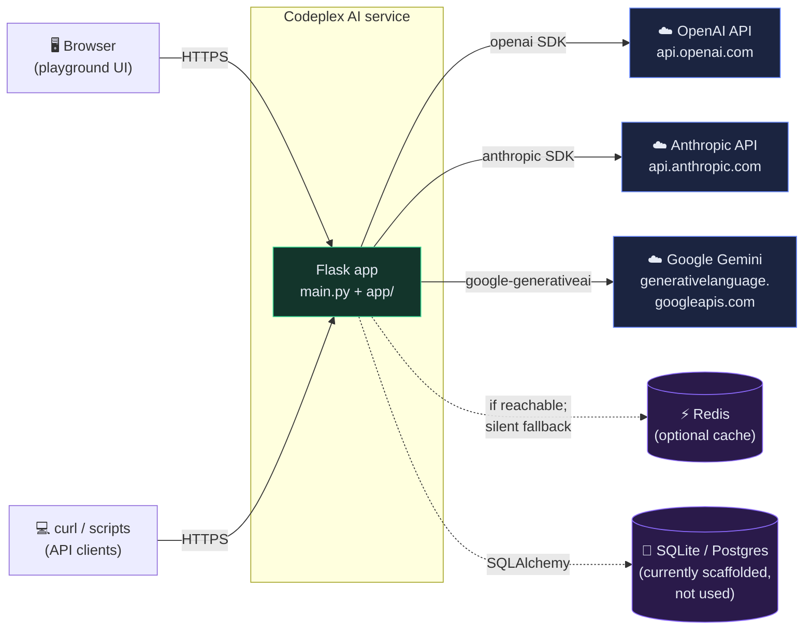
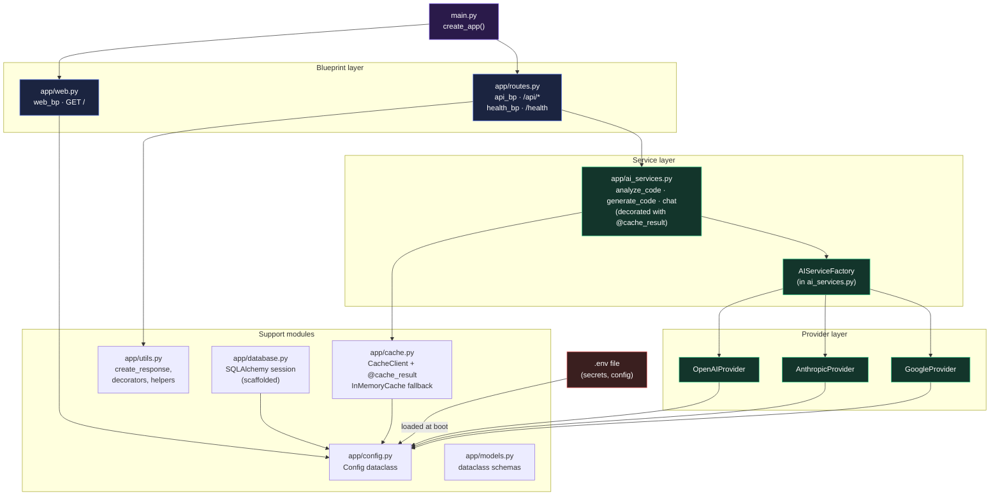
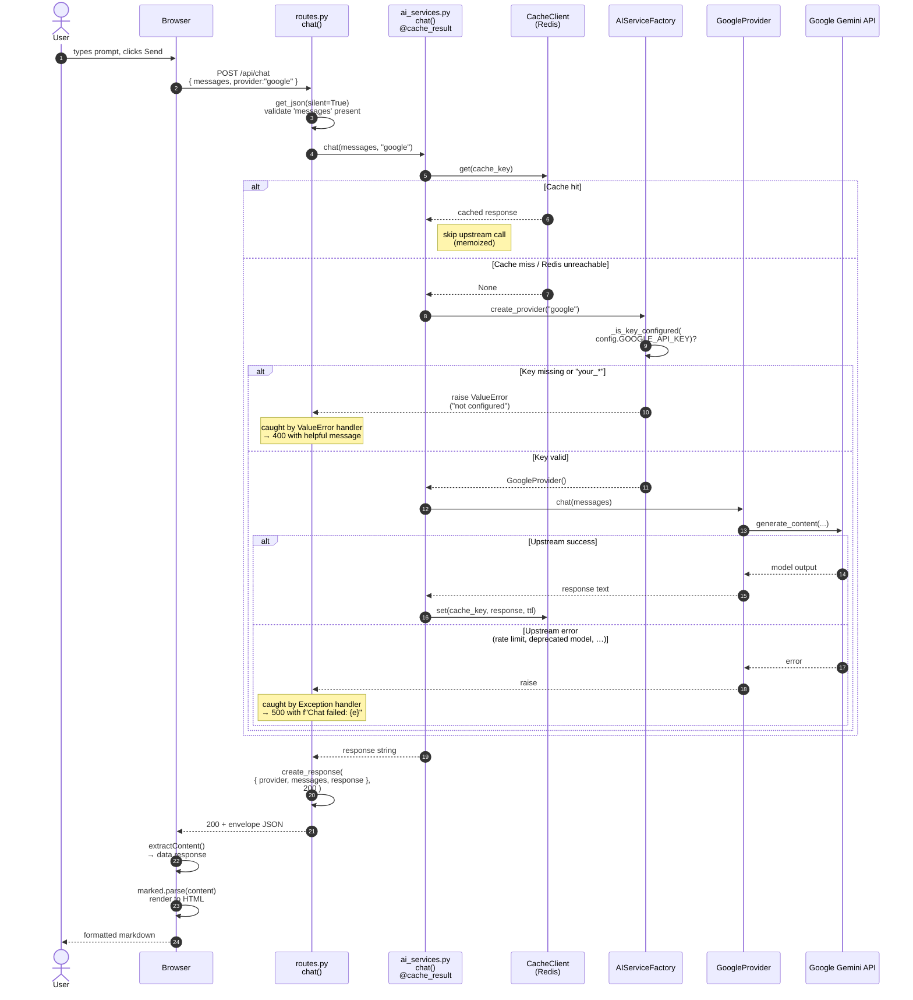
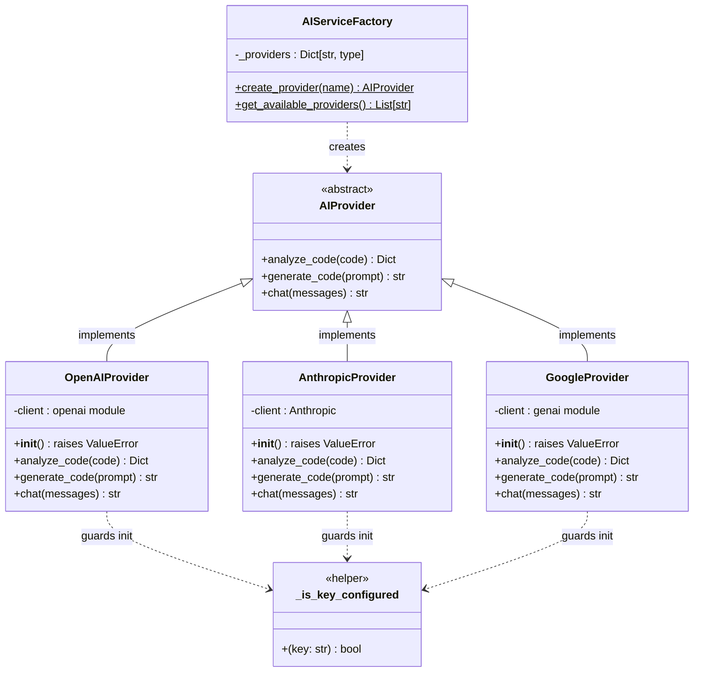
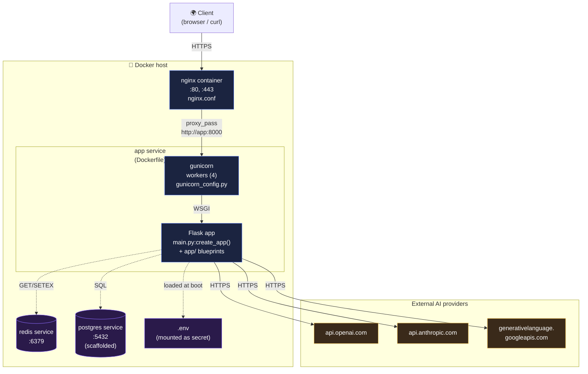

# Architecture & design notes

This document explains *why* the code is shaped the way it is — design decisions, deliberate trade-offs, and pitfalls discovered along the way. Use it when modifying the codebase or onboarding new contributors.

If you only want to *use* the service, [README.md](README.md) is the right starting point.

---

## Architecture diagrams

Five views of the same system, in increasing detail. Each diagram answers a different question.

### 1. System context — *who talks to what?*

The 30,000-foot view. Where Codeplex AI sits between users and upstream AI providers.



### 2. Component diagram — *how are the modules wired?*

Every Python module in `app/` and how they depend on each other. Arrows mean "imports / calls into".



### 3. Request sequence — *what happens when someone sends a chat message?*

Full lifecycle of a single `POST /api/chat` request, including the cache hit/miss branch and the markdown rendering on the return trip.



### 4. Provider class hierarchy — *how is provider abstraction structured?*

The factory pattern that lets us add a fourth provider without touching routes or helpers.



### 5. Deployment topology — *how does it run in production?*

The shape of a Docker-Compose-based production deployment per [DEPLOYMENT.md](DEPLOYMENT.md) and [docker-compose.yml](docker-compose.yml). Dev setups can collapse this to a single `python main.py` process.



---

## Layers

The app is structured as four cleanly-separated layers. Each layer talks only to the one directly below it.

```
┌─────────────────────────────────────────────────────────┐
│ 1. Web playground  (app/web.py)                          │  Browser UI
│    HTML + CSS + JS template, calls layer 2 over fetch    │
├─────────────────────────────────────────────────────────┤
│ 2. HTTP routes     (app/routes.py)                       │  REST API
│    Validates request shape, returns standard envelope    │
├─────────────────────────────────────────────────────────┤
│ 3. AI helpers      (app/ai_services.py)                  │  Provider-agnostic
│    @cache_result wrapped, picks provider via factory     │
├─────────────────────────────────────────────────────────┤
│ 4. Providers       (app/ai_services.py: *Provider)       │  SDK-specific
│    OpenAI / Anthropic / Google — concrete impls          │
└─────────────────────────────────────────────────────────┘
```

**Why this split?**
- **Layer 1 (web) ↔ Layer 2 (routes)** are HTTP-coupled but otherwise independent. The playground is one consumer; a curl script or external client is another.
- **Layer 2 (routes) ↔ Layer 3 (helpers)** keeps the HTTP concerns (parsing JSON, building envelopes, mapping exceptions to status codes) out of the AI logic. Want to call the AI from a CLI? Import the helper directly — no Flask required.
- **Layer 3 (helpers) ↔ Layer 4 (providers)** lets us add a fourth provider without touching routes or helpers — just write a new `XYZProvider(AIProvider)` subclass and register it in `AIServiceFactory._providers`.

---

## Provider abstraction (`AIProvider` ABC)

All three providers — OpenAI, Anthropic, Google — implement the same three methods (`analyze_code`, `generate_code`, `chat`). The differences are hidden:

| Concern | OpenAI | Anthropic | Google |
|---------|--------|-----------|--------|
| Auth   | `openai.api_key = ...` | `Anthropic(api_key=...)` | `genai.configure(api_key=...)` |
| Call   | `ChatCompletion.create(messages=...)` | `messages.create(messages=..., max_tokens=...)` | `GenerativeModel(...).generate_content(...)` |
| Token count | `response.usage.total_tokens` | `usage.input_tokens + usage.output_tokens` | not provided (returns 0) |
| Multi-turn chat | Pass full `messages` array | Pass full `messages` array | `start_chat()` + iterative `send_message()` |

The factory normalizes this — callers just say `AIServiceFactory.create_provider('google')` and get something that responds to `.chat(messages)`.

### Why we reject `your_*` placeholders explicitly

`_is_key_configured()` checks both that the key is non-empty AND that it doesn't start with `your_`. Reason: the `.env.example` ships placeholders like `your_openai_api_key_here`, and copying that file produces a `.env` with non-empty-but-fake keys. Without this check, the upstream API call gets attempted with a fake key and fails with a confusing "auth error" instead of a clean "key not configured" error.

The check is duplicated as `_key_set()` in `app/web.py` so the homepage status pills can reflect configuration *before* a request is attempted. That duplication is deliberate — `web.py` is a presentation concern; `ai_services.py` is the gate.

---

## The response envelope

Every successful and failed response (except for malformed-JSON cases handled by Flask itself) follows this shape:

```json
{
  "timestamp": "2026-04-29T01:15:14.523864",
  "status_code": 200,
  "data": { ... }
}
```

`create_response()` in `app/utils.py` is the single source of truth for this shape. Routes call it; nothing else should manually build the envelope.

**Why the envelope?** It gives clients a consistent shape to parse. They always know `data` is the payload, regardless of whether it's success or failure. Errors always live in `data.error`. No special-casing the success vs error response shapes.

---

## Caching strategy

`@cache_result` (in `app/cache.py`) wraps the three AI helpers in `app/ai_services.py`. Identical `(input, provider)` pairs return cached results without re-calling the upstream API.

The cache layer is **defensively designed**:
- `CacheClient.__init__` calls `redis_client.ping()` immediately. If Redis is unreachable, `self.redis_client = None` and every operation no-ops.
- `cache_result` checks `config.ENABLE_CACHING` first; if False, it skips caching entirely.
- Get/set errors are logged but don't propagate — caller code never sees a cache failure.

**Result:** the app works identically whether Redis is running or not. Local dev needs no Redis; production gets caching automatically when you `docker-compose up`.

There's also an `InMemoryCache` class for cases where you want a *required* fallback (vs. the silent no-op). Not currently wired into the helpers — it's there for future use.

### Cache key generation

The decorator builds keys as `f"{prefix}:{args}:{kwargs}"`. For chat, `args[0]` is a list of message dicts; its `repr()` is deterministic in Python, so identical inputs produce identical keys. Don't pass mutable state through the args (e.g. a stateful object) — the repr won't be stable.

---

## Web playground design

The homepage at `/` is a single Jinja-templated HTML page (rendered by `app/web.py`) with three concerns:

1. **Server-rendered status pills** — provider configuration is checked at render time and baked into the HTML. No fetch needed for the initial state.
2. **Client-side playground** — three tabs (Chat / Analyze / Generate) call `/api/chat`, `/api/analyze`, `/api/generate` via `fetch()`. Responses are parsed as JSON, the relevant content field is extracted, and rendered as markdown via `marked.js` (loaded from a CDN).
3. **Raw JSON toggle** — every result lets you flip between the rendered markdown view and the raw envelope, so you can debug API responses without leaving the page.

**Why no SPA framework?** The page is ~150 lines of markup and 80 lines of JS. React or Vue would be 10× the surface area for the same UX. The whole HTML+CSS+JS lives in a single template string in `app/web.py` — easy to edit, no build step.

### Why markdown rendering

Models return markdown by convention — headings, bullet lists, fenced code blocks. Showing that as a raw `\n`-laden monospace dump (the original behavior) felt like a CLI dump. Rendering it gives the response the same visual treatment a chatbot UI would.

`marked.js` is loaded from `cdn.jsdelivr.net` instead of vendored. For a local dev tool this is fine; for an air-gapped deployment, vendor it into `app/static/`.

---

## Pitfalls and design lessons

These are gotchas we hit during initial setup. Most are documented in [README.md](README.md#troubleshooting), but here's the *why*.

### Python 3.11 ceiling

The pinned dependency versions (especially `pydantic 2.0.3` and the now-removed `tensorflow 2.13`) don't have wheels for Python 3.12+ on Windows. We pin 3.11 because:
- 3.11 has wheels for everything in `requirements.txt`
- It's still supported by every provider SDK
- Bumping to 3.12 means bumping pydantic, which means bumping FastAPI-style validation patterns elsewhere

If you need 3.12, expect a coordinated dependency upgrade (~1 day of work).

### `tensorflow` was never used

The original `requirements.txt` listed tensorflow, torch, transformers, scikit-learn, pandas, numpy, langchain, huggingface, psycopg2, alembic, uvicorn, and python-multipart — none of which are actually imported anywhere in the source. We trimmed `requirements.txt` from 26 packages to 13. **Lesson:** when adding a dependency, also add the import. Otherwise it's just installer overhead.

### `gemini-pro` deprecated

Google deprecated the bare `gemini-pro` model name in 2025 in favor of `gemini-1.5-flash`, `gemini-2.0-flash`, etc. The default in `.env.example` is still `gemini-pro` for backward compat with old guides, but the README and config table push users to `gemini-2.5-flash`.

### Windows console encoding

Python's default I/O encoding on Windows is whatever the system codepage is (usually `cp1252`), not UTF-8. Anything that prints a non-ASCII character (like `✓` in `verify_startup.py`) crashes with `UnicodeEncodeError` unless `PYTHONUTF8=1` is set. We document this in the quickstart instead of hardcoding `sys.stdout.reconfigure(encoding='utf-8')` in every entry point.

### `setup.sh` doesn't work on Windows

`setup.sh` uses `source venv/bin/activate` — the Linux venv path. On Windows venvs activate via `venv\Scripts\activate.bat` (cmd) or `venv\Scripts\Activate.ps1` (PowerShell). We kept `setup.sh` for Linux/Mac and added `setup.bat` for Windows. Don't try to make one cross-platform — they're different OS conventions, and conditional logic in shell scripts is fragile.

### Generic "Chat failed" errors

Originally, route exception handlers returned hardcoded messages like `"Chat failed"` with status 500, swallowing the actual upstream error. We changed them to `f"{operation} failed: {error_message}"` so deprecated models, rate limits, network errors, and auth failures all surface with the actual cause. **Lesson:** for an API that wraps third-party services, error transparency > error normalization. Clients want to know *which* upstream broke and *why*, not just that "something" did.

---

## What's stubbed (deliberately)

The `Known limitations` section of [README.md](README.md#known-limitations) lists features that are scaffolded but not wired:

- Rate limiting (`utils.py:rate_limit` is a no-op decorator)
- Analytics
- JWT auth (`JWT_SECRET` exists; no middleware checks it)
- Database persistence (`app/database.py` configures a session factory; no models save anything)
- Streaming responses (all calls block until complete)

These are present in `config.py` and the codebase for forward-compatibility — if you wire them up, the env vars and code skeletons are already there. We chose to ship without them because none are required for the core "front three AI providers" use case, and shipping unused complexity is a tax on every reader of the codebase.

---

## Where to make changes

| Goal | File(s) to touch |
|------|------------------|
| Add a 4th AI provider                       | `app/ai_services.py` — add `XYZProvider(AIProvider)`, register in factory |
| Add a new `/api/...` endpoint               | `app/routes.py` |
| Change the playground UI                    | `app/web.py` (everything is in `INDEX_HTML`) |
| Add a config knob                           | `app/config.py` (and document in README) |
| Wire up rate limiting                       | `app/utils.py:rate_limit` + apply in routes |
| Switch from SQLite to Postgres              | `.env`: `DATABASE_URL=postgresql://...` |
| Add tests                                    | `tests/test_api.py` (mock providers via `unittest.mock.patch`) |
| Vendor `marked.js`                          | Save to `app/static/marked.min.js`, configure Flask static, update `web.py` script tag |
