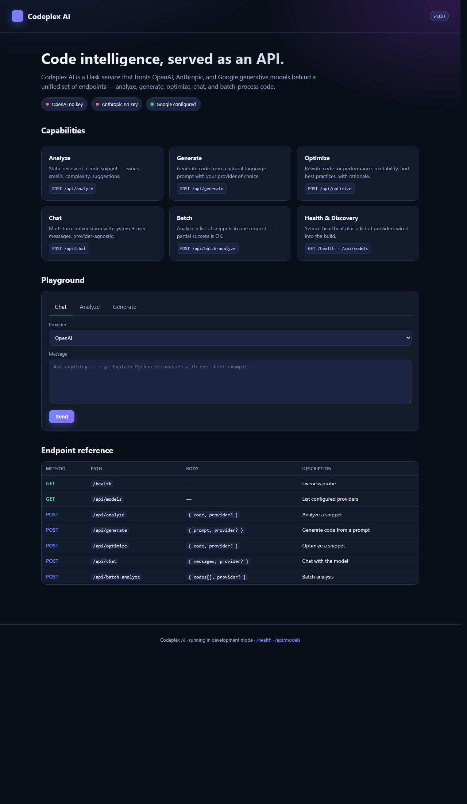

# Codeplex AI

A Flask service that fronts **OpenAI**, **Anthropic**, and **Google Gemini** behind a single set of REST endpoints — analyze, generate, optimize, chat, and batch-analyze code — plus a built-in interactive web playground at `/` with markdown-rendered responses.

Pick any provider per request via a `provider` field; the service abstracts away the SDK differences and returns a consistent response envelope.



---

## Table of contents

- [Features](#features)
- [Quick start](#quick-start)
- [Web playground](#web-playground)
- [API reference](#api-reference)
- [Configuration](#configuration)
- [How a request flows](#how-a-request-flows)
- [Testing](#testing)
- [Docker](#docker)
- [Troubleshooting](#troubleshooting)
- [Project layout](#project-layout)
- [Known limitations](#known-limitations)
- [License](#license)

---

## Features

- **Three providers, one API** — OpenAI, Anthropic, and Google Gemini, selected via a `provider` field on each request
- **Web playground** at `/` with three interactive tabs (Chat / Analyze / Generate), provider switcher, live status pills showing which keys are configured, and **proper markdown rendering** of model output (headings, lists, code blocks, tables) plus a *Show raw JSON* toggle
- **Standardized response envelope** — every endpoint returns `{ timestamp, status_code, data }` for consistent client parsing
- **Helpful errors** — missing keys, deprecated models, and upstream failures surface the actual cause; placeholder keys (`your_*_key_here`) are detected and rejected before any upstream call
- **Optional Redis cache** — falls back silently to in-memory cache if Redis is unreachable, so local dev never requires Redis
- **SQLite default** for the database — no setup required to get started; swap to PostgreSQL via `DATABASE_URL` for production
- **Docker-ready** — Dockerfile and docker-compose included
- **CORS configured** for `/api/*` endpoints
- **Unit-tested** — 13 tests covering every endpoint with mocked AI providers

---

## Quick start

### Prerequisites

- **Python 3.11** (3.12+ won't work — some pinned dependencies don't have wheels for 3.12)
- A Google AI Studio API key (free tier, no card required) — https://aistudio.google.com/app/apikey
  - Or an Anthropic / OpenAI key if you prefer

### Windows (PowerShell)

```powershell
git clone https://github.com/luniemma/codeplex-application-ai-systhem.git
cd codeplex-application-ai-systhem

python -m venv venv
.\venv\Scripts\python.exe -m pip install --upgrade pip
.\venv\Scripts\python.exe -m pip install -r requirements.txt

copy .env.example .env
# Edit .env — replace placeholders with at least one real API key
# Recommended: GOOGLE_MODEL=gemini-2.5-flash (the default 'gemini-pro' is deprecated)

$env:PYTHONUTF8 = "1"
.\venv\Scripts\python.exe main.py
```

### macOS / Linux

```bash
git clone https://github.com/luniemma/codeplex-application-ai-systhem.git
cd codeplex-application-ai-systhem

python3.11 -m venv venv
source venv/bin/activate
pip install --upgrade pip
pip install -r requirements.txt

cp .env.example .env
# Edit .env — replace placeholders with at least one real API key

python main.py
```

Then open **http://127.0.0.1:8000/** in your browser.

### Smoke-test the running server

Once it's up, these URLs work in any browser (all `GET`):

| URL | What you'll see |
|-----|-----------------|
| http://localhost:8000/             | Web playground (Chat / Analyze / Generate tabs) |
| http://localhost:8000/health       | `{"status": "healthy", ...}` — liveness alias |
| http://localhost:8000/livez        | Same as `/health` — Kubernetes liveness probe |
| http://localhost:8000/readyz       | `200` if at least one provider key is configured, else `503` |
| http://localhost:8000/api/models   | List of registered providers |

The other endpoints (`/api/analyze`, `/api/generate`, `/api/optimize`, `/api/chat`, `/api/batch-analyze`) are **POST-only** — they won't render in a browser address bar. Hit them from the playground at `/`, or with `curl`:

```bash
curl -s -X POST http://localhost:8000/api/analyze \
  -H 'Content-Type: application/json' \
  -d '{"code":"def add(a,b):\n    return a+b","provider":"google"}'
```

---

## Web playground

The homepage at `/` gives you a self-contained UI for the API — no Postman, no curl needed.

**What you'll see:**
- **Provider status pills** — green = key configured, red = not configured (placeholders count as not configured)
- **Capability cards** for the six core operations
- **Three interactive tabs** — Chat, Analyze, Generate. Pick a provider, type a prompt, click Send. Responses render as proper markdown.
- **Endpoint reference table** with method, path, body shape, and description
- **Show raw JSON** toggle on every result, in case you want to inspect the full envelope

The playground calls the same `/api/*` endpoints your client code would, so anything you can do in the playground you can do from a script.

---

## API reference

All endpoints return the standard envelope:

```json
{
  "timestamp": "2026-04-29T01:15:14.523864",
  "status_code": 200,
  "data": { /* endpoint-specific payload */ }
}
```

Errors share the same shape: `data.error` contains the message.

> **CORS** is configured for `/api/*` only (see `CORS_ORIGINS`). Health probes (`/livez`, `/health`, `/readyz`) and the web UI (`/`) are same-origin.
>
> **Rate limit:** the `/api/*` blueprint is limited to **30 requests/minute** per client (configurable via the `app.security` limiter; backed by Redis if `REDIS_URL` is reachable, in-memory otherwise).

### `GET /livez`, `GET /health`

Liveness probe — both paths are aliases. Returns `200` as long as the WSGI app is responding (used by Kubernetes' `livenessProbe`; failure restarts the pod). No auth, no body.

```json
{ "data": { "status": "healthy", "service": "codeplex-ai", "version": "1.0.0" } }
```

### `GET /readyz`

Readiness probe. Returns `200` only if **at least one provider key is configured** (i.e. the service can plausibly serve a real request); otherwise `503`. Used by Kubernetes' `readinessProbe` — a failing `/readyz` removes the pod from the service load balancer without restarting it.

```json
{
  "data": {
    "status": "ready",
    "providers": { "openai": false, "anthropic": false, "google": true }
  }
}
```

### `GET /api/models`

Lists which providers the service is built with.

```json
{ "data": { "providers": ["openai", "anthropic", "google"], "count": 3 } }
```

> Note: this lists *registered* providers, not necessarily ones with keys configured. Use the homepage status pills (or check `.env`) to see which are usable.

### `POST /api/analyze`

Analyze a code snippet with the chosen provider.

**Request**
```json
{
  "code": "def add(a, b):\n    return a + b",
  "provider": "google"
}
```

**Response**
```json
{
  "data": {
    "provider": "google",
    "analysis": "The function is correct but lacks type hints and a docstring...",
    "tokens_used": 142
  }
}
```

**Errors**: `400` if `code` is missing or empty; `400` if the provider's key isn't configured; `500` for upstream failures (with the upstream error message).

### `POST /api/generate`

Generate code from a natural-language prompt.

**Request**
```json
{
  "prompt": "Write a Python function that returns the nth Fibonacci number iteratively.",
  "provider": "google"
}
```

**Response**
```json
{
  "data": {
    "provider": "google",
    "prompt": "Write a Python function...",
    "generated_code": "def fib(n):\n    a, b = 0, 1\n    for _ in range(n):\n        a, b = b, a + b\n    return a"
  }
}
```

### `POST /api/optimize`

Rewrite code for performance, readability, and best practices, with rationale. Internally builds a structured prompt asking for issues identified, optimized version, explanation, and performance improvements.

**Request**
```json
{
  "code": "def slow(n):\n    r = []\n    for i in range(n):\n        r = r + [i]\n    return r",
  "provider": "google"
}
```

**Response**
```json
{
  "data": {
    "provider": "google",
    "original_code": "def slow(n):...",
    "optimized_code": "## Issues\n1. Inefficient list concatenation...\n\n## Optimized\n```python\ndef fast(n):\n    return list(range(n))\n```\n..."
  }
}
```

### `POST /api/chat`

Multi-turn chat. Pass an array of `{role, content}` messages.

**Request**
```json
{
  "messages": [
    { "role": "system", "content": "You are a concise code reviewer." },
    { "role": "user",   "content": "Why is mutable default arguments a Python footgun?" }
  ],
  "provider": "google"
}
```

**Response**
```json
{
  "data": {
    "provider": "google",
    "messages": [/* echoed input */],
    "response": "Mutable default arguments are evaluated once at function definition..."
  }
}
```

> Roles supported: `system`, `user`, `assistant`. The Google provider currently maps the conversation onto its `start_chat()` API.

### `POST /api/batch-analyze`

Analyze a list of snippets in one request. Per-item failures don't fail the whole batch.

**Request**
```json
{
  "codes": ["print('hi')", "for i in range(10): pass"],
  "provider": "google"
}
```

**Response**
```json
{
  "data": {
    "provider": "google",
    "total": 2,
    "results": [
      { "index": 0, "status": "success", "data": { "analysis": "...", "tokens_used": 89 } },
      { "index": 1, "status": "error",   "error": "..." }
    ]
  }
}
```

### `GET /`

Serves the web playground (HTML).

---

## Logging & observability

On boot, the service logs a startup banner showing effective config — environment, bind, configured providers (with placeholder keys correctly counted as "disabled"), Redis reachability, and (redacted) database URL — so an operator can verify things at a glance without grepping through the codebase:

```
============================================================
Codeplex AI starting
  environment   = development
  bind          = 127.0.0.1:8000
  log_level     = INFO
  log_format    = text
  providers     = enabled=['google'], disabled=['openai', 'anthropic']
  cache (redis) = not reachable (in-memory fallback)
  caching flag  = True
  database_url  = sqlite:///./codeplex.db
============================================================
```

Every request gets a 12-character **request ID** that's:
- Generated in a `before_request` hook
- Attached to every log record produced by that request via Flask's `g`
- Returned to the client in an `X-Request-ID` response header so users can quote it in bug reports

Each successful request produces a small set of correlated log lines that, taken together, tell you exactly what happened:

```
INFO app.cache         [req=33d51f31d790] cache miss prefix=chat — calling upstream
INFO app.ai_services   [req=33d51f31d790] provider_call provider=google op=chat status=ok duration_ms=882
INFO app.access        [req=33d51f31d790] POST /api/chat 200 (1243ms, 234B)
```

`/health` requests are demoted to DEBUG so health probes don't drown out real traffic. Provider failures (deprecated model, rate limit, network error) log at WARNING with the provider name, op, duration, and the actual upstream error message.

### Log format

Set `LOG_FORMAT=text` (default) for human-readable output, or `LOG_FORMAT=json` for one JSON object per line — drop into Datadog, Loki, CloudWatch, or any aggregator without parsing pain. JSON output includes `request_id`, `ai_provider`, `duration_ms`, and any custom keys passed via `logger.info(..., extra={...})`.

```json
{"timestamp":"2026-04-29T02:09:57.123Z","level":"INFO","logger":"app.ai_services",
 "message":"provider_call provider=google op=chat status=ok duration_ms=882",
 "request_id":"33d51f31d790","ai_provider":"google","provider":"google",
 "op":"chat","duration_ms":882,"status":"ok"}
```

## Configuration

All settings come from `.env`. Copy `.env.example` to `.env` and fill in keys.

### Required for at least one provider

| Variable | Where to get | Free tier? |
|----------|--------------|------------|
| `OPENAI_API_KEY`     | https://platform.openai.com/api-keys      | No (paid only) |
| `ANTHROPIC_API_KEY`  | https://console.anthropic.com/            | Some free credits on signup |
| `GOOGLE_API_KEY`     | https://aistudio.google.com/app/apikey    | **Yes — recommended for testing** |

### All settings

| Variable | Default | Notes |
|----------|---------|-------|
| `APP_NAME`             | `Codeplex AI` | |
| `APP_VERSION`          | `1.0.0` | |
| `DEBUG`                | `False` | Set `True` for Flask dev mode |
| `ENVIRONMENT`          | `production` | Used in logs and the homepage footer |
| `API_HOST`             | `0.0.0.0` | Use `127.0.0.1` for local-only |
| `API_PORT`             | `8000` | |
| `API_WORKERS`          | `4` | Used by gunicorn config, not dev mode |
| `OPENAI_MODEL`         | `gpt-4` | Set to `gpt-3.5-turbo` if no GPT-4 access |
| `OPENAI_TEMPERATURE`   | `0.7` | |
| `ANTHROPIC_MODEL`      | `claude-3-opus` | |
| `GOOGLE_MODEL`         | `gemini-pro` | **Deprecated** — use `gemini-2.5-flash` |
| `DATABASE_URL`         | `sqlite:///./codeplex.db` | |
| `REDIS_URL`            | `redis://localhost:6379/0` | Optional; cache falls back to in-memory |
| `LOG_LEVEL`            | `INFO` | |
| `LOG_FILE`             | `logs/codeplex.log` | |
| `SECRET_KEY`           | dev placeholder | **Change for production** |
| `JWT_SECRET`           | dev placeholder | **Change for production** |
| `CORS_ORIGINS`         | `*` | Comma-separated for prod |
| `ENABLE_CACHING`       | `True` | |
| `ENABLE_RATE_LIMITING` | `True` | (currently a flag only — not enforced) |
| `MAX_REQUEST_SIZE`     | `10485760` | 10 MB |
| `REQUEST_TIMEOUT`      | `30` | Seconds |
| `CACHE_TTL`            | `3600` | Seconds |
| `CACHE_MAX_SIZE`       | `1000` | In-memory cache item limit |

---

## How a request flows

```
Browser / curl
      │
      ▼
[ Flask app ]  main.py: create_app()
      │
      ▼
[ Blueprint ]  app/routes.py — validates JSON shape, picks helper
      │
      ▼
[ AI helper ] app/ai_services.py — analyze_code() / generate_code() / chat()
      │
      ▼
[ Factory  ]  AIServiceFactory.create_provider(provider_name)
      │       (validates API key, raises ValueError if not configured)
      ▼
[ Provider ]  OpenAIProvider | AnthropicProvider | GoogleProvider
      │
      ▼
[ Upstream ]  api.openai.com / api.anthropic.com / generativelanguage.googleapis.com
      │
      ▼
[ Wrapped ]   create_response(data, status_code) → standard envelope
      │
      ▼
   Client
```

Errors are caught at two layers:
- `ValueError` from missing keys / invalid input → `400` with the actual message
- All other exceptions → `500` with `f"<operation> failed: {error_message}"` (the underlying error is preserved, not swallowed)

---

## Testing

```bash
pytest tests/                # run all tests
pytest tests/ --cov=app      # with coverage
pytest tests/ -v             # verbose
```

The test suite (`tests/test_api.py`) mocks the AI providers via `unittest.mock.patch`, so tests don't make network calls and don't need API keys. Coverage:

| Class | What it tests |
|-------|---------------|
| `TestHealthEndpoint`        | `/health` returns 200 with `status: healthy` (alias `/livez` shares the handler; `/readyz` is not currently covered) |
| `TestModelsEndpoint`        | `/api/models` returns the provider list |
| `TestAnalyzeEndpoint`       | Missing/empty code → 400; valid → 200 with mocked result |
| `TestGenerateEndpoint`      | Missing/empty prompt → 400; valid → 200 |
| `TestOptimizeEndpoint`      | Missing code → 400; valid → 200 |
| `TestChatEndpoint`          | Missing/empty messages → 400; valid → 200 |
| `TestBatchAnalyzeEndpoint`  | Missing codes → 400; valid → 200 with results array |
| `TestErrorHandling`         | 404 on unknown route; 400/422 on malformed JSON |

---

## Docker

### Build locally

```bash
# Build and run as a single container
docker build -t codeplex-ai .
docker run -p 8000:8000 --env-file .env codeplex-ai
```

### Pull from a registry

Every push to `master` triggers [.github/workflows/docker.yml](.github/workflows/docker.yml), which builds the image, smoke-tests it (boots the container and verifies `/health` returns the healthy envelope), and publishes it to **both** GitHub Container Registry **and** Docker Hub.

**From Docker Hub:**

```bash
docker pull luniemma/codeplex-ai:latest
docker run -p 8000:8000 --env-file .env luniemma/codeplex-ai:latest
```

**From GHCR:**

```bash
docker pull ghcr.io/luniemma/codeplex-application-ai-systhem:latest
docker run -p 8000:8000 --env-file .env \
  ghcr.io/luniemma/codeplex-application-ai-systhem:latest
```

> First-time visibility: both registries default to **private**. To allow unauthenticated pulls:
> - Docker Hub: hub.docker.com → repo → Settings → make Public
> - GHCR: GitHub profile → Packages → this package → Package settings → Change visibility

#### One-time setup for Docker Hub publishing

Before the workflow can push to Docker Hub, add two repo secrets at GitHub → repo → **Settings → Secrets and variables → Actions**:

| Secret | Value |
|--------|-------|
| `DOCKERHUB_USERNAME` | Your Docker Hub login |
| `DOCKERHUB_TOKEN`    | A Docker Hub **access token** (not your password). Create one at https://hub.docker.com/settings/security |

The workflow uses these secrets only when pushing on `master`. PRs build and smoke-test without ever needing them.

### docker-compose

```bash
# Bundled compose file (includes Redis, Postgres, nginx)
docker-compose up
```

---

## Kubernetes

Two equivalent deployment paths — pick whichever fits your cluster:

### Raw manifests ([`k8s/`](k8s/README.md))

`kubectl apply -f k8s/` brings up the app, Redis, **and** a self-contained Prometheus + Grafana stack — no operator, no Helm, just `kubectl`. Manifests are numbered so lexical ordering matches apply ordering.

```bash
cp k8s/11-secret.example.yaml k8s/11-secret.yaml      # fill in real API keys
kubectl apply -f k8s/
kubectl -n codeplex-ai port-forward svc/grafana 3000:3000   # admin / admin
```

The bundled Grafana auto-imports a "Codeplex AI" dashboard with request rate, latency percentiles, error rate, top routes, and per-pod resource usage.

### Helm chart ([`helm/codeplex-ai/`](helm/codeplex-ai/README.md))

Standard Helm chart for the app, designed to integrate with [kube-prometheus-stack](https://github.com/prometheus-community/helm-charts/tree/main/charts/kube-prometheus-stack) — emits a `ServiceMonitor` and a Grafana dashboard `ConfigMap` with the `grafana_dashboard: "1"` label that the Grafana sidecar auto-discovers.

```bash
helm install codeplex-ai ./helm/codeplex-ai \
  --namespace codeplex-ai --create-namespace \
  --set secrets.values.GOOGLE_API_KEY=AIza... \
  --set serviceMonitor.enabled=true \
  --set serviceMonitor.labels.release=monitoring \
  --set grafanaDashboard.enabled=true
```

The chart's `values.yaml` documents every knob: replicas, autoscaling thresholds, resource limits, ingress, ServiceMonitor labels, etc. For full options see [helm/codeplex-ai/README.md](helm/codeplex-ai/README.md).

### What gets exported to Prometheus

The app mounts `/metrics` via [`app/metrics.py`](app/metrics.py) (auto-instruments every route through `prometheus-flask-exporter`). Useful series:

| Metric                                         | What it counts                                                |
| ---------------------------------------------- | ------------------------------------------------------------- |
| `flask_http_request_total{method,status,path}` | HTTP request count (used for rate, error rate, top routes)    |
| `flask_http_request_duration_seconds_bucket`   | Histogram for p50/p95/p99 latency                              |
| `flask_http_request_exceptions_total`          | Unhandled exceptions per route                                |
| `process_resident_memory_bytes`                | Per-pod RSS                                                    |
| `process_cpu_seconds_total`                    | Per-pod CPU                                                    |
| `codeplex_ai_build_info{version=...}`          | Build/version label for dashboards                            |

The compose file in [docker-compose.yml](docker-compose.yml) wires up the optional Redis cache and Postgres database. For dev with auto-reload, use [docker-compose.dev.yml](docker-compose.dev.yml).

For production behind nginx, see [nginx.conf](nginx.conf) — proxies `/api/*` to the gunicorn workers configured in [gunicorn_config.py](gunicorn_config.py).

---

## Troubleshooting

| Symptom | Cause / Fix |
|---------|-------------|
| `UnicodeEncodeError: 'charmap' codec can't encode '✓'` on Windows | Console encoding is cp1252. Run with `$env:PYTHONUTF8 = "1"` before `python main.py`. |
| `gemini-pro is not found for API version v1beta` | Google deprecated this model name. Set `GOOGLE_MODEL=gemini-2.5-flash` in `.env` and restart. |
| `OPENAI_API_KEY is not configured` after setting it | The placeholder check rejects values starting with `your_`. Make sure you replaced the entire value, not just appended to it. |
| `ResolutionImpossible` during `pip install` | You're on Python 3.12+. Some pinned deps don't have 3.12 wheels — use Python 3.11. |
| VSCode shows "Package X not installed" warnings | VSCode is using your system Python. `Ctrl+Shift+P` → *Python: Select Interpreter* → pick `.\venv\Scripts\python.exe`. |
| `source venv/bin/activate` fails on Windows | That's a Linux path. Use `venv\Scripts\activate.bat` on cmd, or just call `.\venv\Scripts\python.exe` directly without activating. |
| Redis connection failures in logs | Expected if you're not running Redis. The cache falls back to in-memory automatically — ignore unless you need persistence across restarts. |
| Browser shows 404 at `http://localhost:8000/` | Old version. The current build serves a homepage at `/` — pull the latest `master`. |

---

## Project layout

```
.
├── main.py                   # Flask app factory + dev server entry point
├── app/
│   ├── __init__.py
│   ├── routes.py             # /health, /api/* endpoints
│   ├── web.py                # /  (web playground HTML/CSS/JS)
│   ├── ai_services.py        # AIProvider ABC + OpenAI/Anthropic/Google impls + factory
│   ├── config.py             # Env-backed Config dataclass
│   ├── models.py             # Request/response dataclasses
│   ├── cache.py              # CacheClient (Redis) + InMemoryCache fallback
│   ├── database.py           # SQLAlchemy engine + sessionmaker
│   └── utils.py              # create_response, decorators, helpers
├── tests/
│   ├── __init__.py
│   └── test_api.py           # pytest suite, all endpoints
├── requirements.txt          # Python deps (trimmed to what's actually imported)
├── .env.example              # Config template
├── .gitignore
├── Dockerfile
├── Dockerfile.dev
├── docker-compose.yml
├── docker-compose.dev.yml
├── gunicorn_config.py        # Production WSGI server config
├── nginx.conf                # Reverse-proxy template
├── verify_startup.py         # Sanity check: deps, env, blueprints
├── setup.bat                 # Windows setup (calls python, pip, copies .env)
├── setup.sh                  # Unix setup script (don't use on Windows — bash venv path)
├── Makefile                  # Common dev commands
└── quick_test.bat            # Hits a few endpoints with curl
```

---

## Known limitations

Honest about what's there vs. what's stubbed:

- **Rate limiting** — `ENABLE_RATE_LIMITING` flag exists, but no decorator currently enforces it. Wire `app/utils.py:rate_limit` (which is also currently a placeholder) into the routes if you need it.
- **Caching** — `@cache_result` is wired onto the AI helpers (`analyze_code`, `generate_code`, `chat`); identical `(input, provider)` pairs are memoized through Redis when available, no-op when not. Per-route TTL/key customization isn't exposed yet.
- **Analytics** — `ENABLE_ANALYTICS` flag and `ANALYTICS_BATCH_SIZE` exist, but no analytics pipeline is wired.
- **Database** — SQLAlchemy session factory is configured, but no models hit the DB. `codeplex.db` is created but unused. The DB layer is scaffolded for future per-request logging.
- **JWT auth** — `JWT_SECRET` is in config, but no auth middleware guards the endpoints. The API is open by default.
- **`async`/streaming responses** — all calls are blocking. Long generations return only when complete.
- **`MAX_REQUEST_SIZE`** is enforced at the Flask level via `MAX_CONTENT_LENGTH`, but `REQUEST_TIMEOUT` is not currently applied to upstream calls — slow providers will hold the request open.

If you need any of these wired up for production, open an issue or PR.

---

## Further reading

- [ARCHITECTURE.md](ARCHITECTURE.md) — design decisions, layer breakdown, and the *why* behind non-obvious code (provider abstraction, cache fallback, placeholder key detection, etc.)
- [DEPLOYMENT.md](DEPLOYMENT.md) — pre-deploy checklist and deployment strategies (Docker, compose, gunicorn+nginx)
- [SECURITY.md](SECURITY.md) — vulnerability disclosure policy + what's already hardened in published images
- [CHANGELOG.md](CHANGELOG.md) — notable changes per release

## License

MIT — see [LICENSE](LICENSE)
